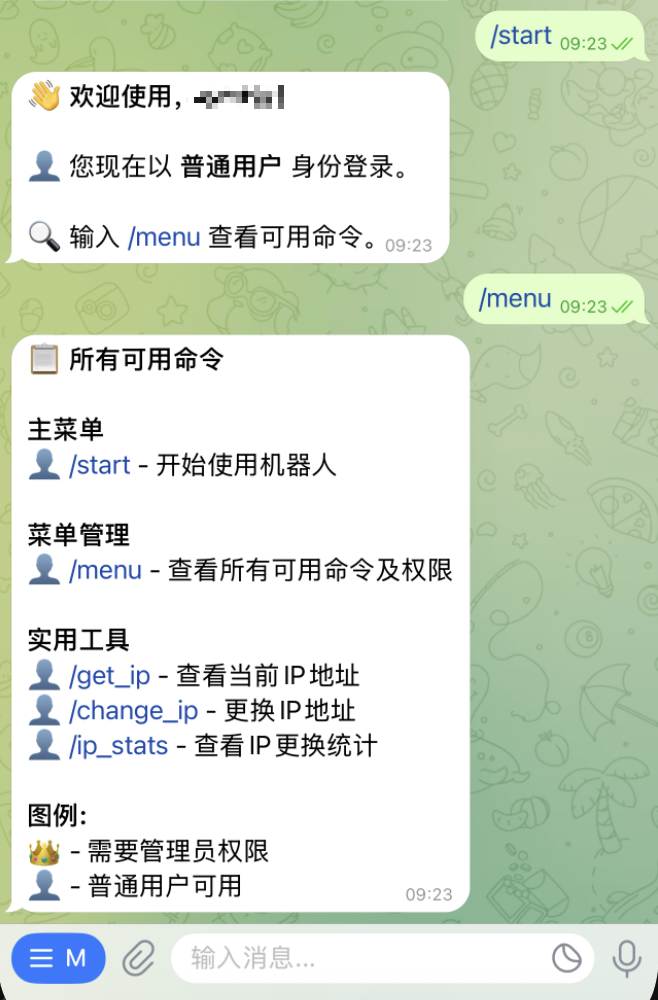
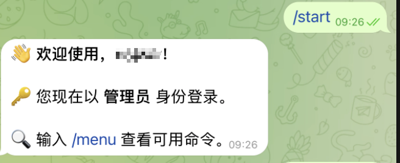

# telegram-bot-template
一个功能完善的Telegram机器人模板。集成actions自动构建，一键安装脚本，插件式命令系统，用户权限管理。

## 功能特点

- 📦 **插件式命令系统** - 轻松添加新命令，无需修改核心代码
- 👤 **用户权限管理** - 管理员和普通用户权限分离
- 🔄 **自动注册命令** - 符合命名规范的命令自动被发现和注册
- 📋 **命令菜单管理** - 可查看所有可用命令及其权限
- 👑 **用户管理功能** - 管理员可添加/删除普通用户和其他管理员
- ⚙️ **配置文件支持** - 通过YAML配置文件覆盖命令默认设置
- 🖥️ **系统状态监控** - 查看机器人运行状态、系统资源使用情况
- 🔧 **简单易用的API** - 清晰的接口设计，便于扩展

## 使用

### 使用install.sh安装(推荐)

1. 运行一键安装脚本
```bash
bash <(curl -L -s https://raw.githubusercontent.com/vvnocode/telegram-bot-template/main/install.sh)
```
2. 根据提示输入Telegram Bot Token和Chat ID

### 手动修改配置文件

安装完成后可以手动修改配置文件，修改完成后需要重启服务：`systemctl restart telegram-bot-template`

配置文件位于 `/etc/telegram-bot-template/config.yaml`，示例：
```yaml
# Telegram配置
telegram_bot_token: ""               # 你的Telegram Bot Token
telegram_admin_id: ""  # 管理员用户ID, 多个用户ID用逗号分隔
telegram_user_id: ""     # 授权的普通用户ID, 多个用户ID用逗号分隔
```

### Telegram Bot 命令

- `/start` - 机器人使用入口
- `/help` - 显示帮助信息
- `/menu` - 查看所有可用命令及权限
- `/admin` - 管理员控制面板(需管理员权限)
- `/users` - 查看所有用户列表(需管理员权限)
- `/adduser` - 添加普通用户(需管理员权限)
- `/deluser` - 删除普通用户(需管理员权限)
- `/addadmin` - 添加管理员(需管理员权限)
- `/deladmin` - 将管理员降级为普通用户(需管理员权限)
- `/status` - 查看系统状态(需管理员权限)

### 服务管理

```bash
# 启动服务
systemctl start telegram-bot-template
# 停止服务
systemctl stop telegram-bot-template
# 重启服务
systemctl restart telegram-bot-template
# 查看服务状态
systemctl status telegram-bot-template
```

## 开发

1. 克隆项目:
```shell
git clone https://github.com/vvnocode/telegram-bot-template.git
cd telegram-bot-template
```

2. 创建并激活虚拟环境:
```shell
python3 -m venv venv
source venv/bin/activate  # Linux/Mac
# 或
.\venv\Scripts\activate  # Windows
```

3. 安装依赖:
```shell
pip install -r requirements.txt
```

4. 本地开发运行:
```shell
python src/main.py
```

## 项目结构

```
telegram-bot-template/
├── config/                   # 配置目录
│   ├── config.yaml           # 主配置文件
│   └── commands.yaml         # 命令配置文件
├── src/                      # 源代码目录
│   ├── __init__.py           # 初始化文件
│   ├── main.py               # 程序入口点
│   ├── config.py             # 配置加载
│   ├── logger.py             # 日志配置
│   ├── bot/                  # 机器人核心功能
│   │   ├── __init__.py
│   │   ├── core.py           # Bot核心类
│   │   └── handlers/         # 命令处理器
│   │       ├── __init__.py   # 处理器注册
│   │       ├── command.py    # 命令插件系统
│   │       ├── start.py      # /start命令处理
│   │       ├── help.py       # /help命令处理
│   │       ├── admin.py      # /admin命令处理
│   │       ├── status.py     # /status命令处理
│   │       ├── user.py       # 用户管理命令
│   │       └── menu.py       # 菜单命令处理
│   ├── auth/                 # 用户认证模块
│   │   ├── __init__.py
│   │   ├── permissions.py    # 权限定义
│   │   └── user.py           # 用户管理
│   └── utils/                # 工具函数
│       ├── __init__.py
│       └── helpers.py
└── requirements.txt          # 依赖列表
```

## 用户权限管理

本机器人实现了完善的用户权限管理机制，分为两种角色：

1. **普通用户**：可以访问基本命令，如`/start`、`/help`和`/menu`
2. **管理员**：除了普通用户的权限外，还可以访问管理命令，如`/admin`、`/status`和用户管理命令

### 添加或删除用户

管理员可以使用以下命令管理用户：

- `/users` - 查看所有用户和管理员列表
- `/adduser <用户ID>` - 添加普通用户（也可转发用户消息后回复此命令）
- `/deluser <用户ID>` - 删除普通用户
- `/addadmin <用户ID>` - 将用户提升为管理员
- `/deladmin <用户ID>` - 将管理员降级为普通用户

### 配置权限

在配置文件`config/config.yaml`中设置用户ID：

```yaml
# 普通用户ID列表，用逗号分隔
telegram_user_id: "USER_ID_1,USER_ID_2"

# 管理员ID列表，用逗号分隔
telegram_admin_id: "ADMIN_ID_1,ADMIN_ID_2"
```

## 插件式命令系统

本机器人采用插件式命令系统，便于扩展新功能：

### 命令定义

每个命令都是一个`CommandPlugin`对象，包含以下属性：

- `command`: 命令名称（不带斜杠）
- `description`: 命令描述
- `handler`: 命令处理函数
- `category`: 命令分类（MAIN/USER/SYSTEM/TOOLS）
- `required_role`: 所需权限（USER/ADMIN）
- `is_visible`: 是否在帮助中显示

### 添加新命令

1. 在`src/bot/handlers/`目录下创建新的命令处理文件
2. 实现命令处理函数和命令注册函数
3. 在`src/bot/handlers/__init__.py`的`modules`列表中添加模块引用

示例：
```python
# my_command.py
from telegram import Update
from telegram.ext import ContextTypes

from src.auth import UserManager, UserRole
from src.bot.handlers.command import CommandPlugin, CommandCategory, CommandRegistry

async def my_command(update: Update, context: ContextTypes.DEFAULT_TYPE, user_manager: UserManager):
    # 命令处理逻辑
    await update.message.reply_text("这是我的自定义命令!")

def register_my_command(command_registry: CommandRegistry):
    command_registry.register_command(
        CommandPlugin(
            command="mycommand",
            description="我的自定义命令",
            handler=my_command,
            category=CommandCategory.TOOLS,
            required_role=UserRole.USER
        )
    )
```

然后在`__init__.py`中添加：
```python
from . import start, help, admin, status, user, menu, my_command

# ...

def auto_register_commands(command_registry: CommandRegistry) -> None:
    modules = [start, help, admin, status, user, menu, my_command]
    # ...
```

### 命令配置

可以在`config/commands.yaml`中覆盖命令的默认设置：

```yaml
commands:
  mycommand:
    description: "自定义命令的新描述"
    category: TOOLS
    required_role: USER
    is_visible: true
```

## 自动构建

1. 支持打tag后，使用actions自动构建。
2. 未使用全局Token，需要自己创建 [tokens](https://github.com/settings/tokens)。
3. 需要配置MY_GITHUB_TOKEN
    路径：Project - Settins -> Security -> Secrets and variables -> Repository secrets
    参数：MY_GITHUB_TOKEN
    值为步骤2的token

## 常见问题

### 1. 如何获取 Telegram Bot Token？
1. 在 Telegram 中找到 @BotFather
2. 发送 `/newbot` 命令
3. 按照提示设置 bot 名称
4. 获取 bot token

### 2. 如何获取 Chat ID？
1. 在 Telegram 中找到 @userinfobot
2. 发送任意消息
3. 机器人会返回你的 Chat ID

### 3. 如何添加用户？
有两种方式：
1. 通过用户ID添加: `/adduser <用户ID>`

## 效果展示

### 普通用户界面


### 管理员界面


### 菜单管理


## 贡献指南
欢迎提交 Pull Request 或 Issue 来帮助改进项目。

## 许可证
MIT License