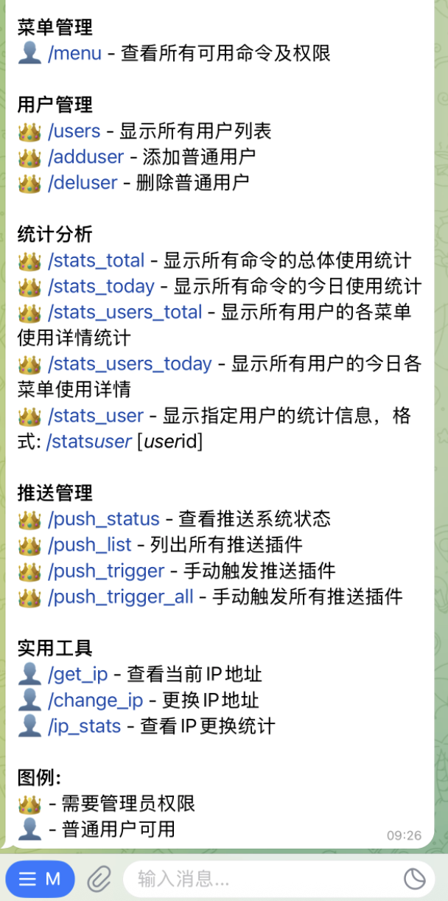
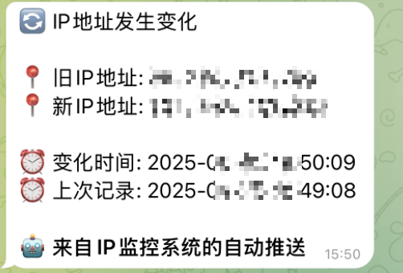

# Telegram Bot Template

A full-featured Telegram bot template with GitHub Actions integration, one-click installation script, plugin-based command system, user permission management, and proactive push notification system.

🇺🇸 English | [🇨🇳 中文](README_ZH.md)

[](https://opensource.org/licenses/MIT)
[](https://www.python.org/downloads/)
[](https://python-telegram-bot.org/)

## ✨ Features

- 📦 **Plugin-based Command System** - Easily add new commands without modifying core code
- 👤 **User Permission Management** - Separate admin and regular user permissions with flexible user management
- 🔄 **Auto Command Registration** - Commands following naming conventions are automatically discovered and registered
- 📋 **Command Menu Management** - View all available commands and their permissions with category display
- 👑 **User Management Features** - Admins can add/remove regular users and other administrators
- 🔌 **Dynamic Plugin Loading** - Support loading plugins from internal and external directories with hot-swapping
- ⚙️ **Configuration File Support** - Control plugin enable/disable through YAML configuration files
- 🖥️ **System Status Monitoring** - View bot running status and system resource usage
- 📡 **Proactive Push System** - Plugin-based push framework supporting IP monitoring and other automatic notifications
- 📊 **Statistical Analysis System** - Complete command usage statistics with time and user analysis
- 🌐 **IP Management Tools** - Built-in IP viewing and management functionality
- 🔧 **Simple and Easy-to-use API** - Clear interface design for easy extension development
- 🚀 **One-click Deployment** - Support automated deployment and service management
- 📋 **Comprehensive Logging System** - Structured logging using loguru
- 🏗️ **GitHub Actions Integration** - Automated building and publishing

## 🚀 Quick Start

### Method 1: One-click Installation Script (Recommended)

```bash
# Install
bash <(curl -L -s https://raw.githubusercontent.com/vvnocode/telegram-bot-template/main/install.sh)

# Uninstall
bash <(curl -L -s https://raw.githubusercontent.com/vvnocode/telegram-bot-template/main/install.sh) uninstall
```

The installation script will automatically:
- Download the latest pre-compiled program
- Create system service
- Set up directory structure
- Configure basic parameters

### Method 2: Manual Installation

1. **Clone the project**
```bash
git clone https://github.com/vvnocode/telegram-bot-template.git
cd telegram-bot-template
```

2. **Create virtual environment**
```bash
python3 -m venv venv
source venv/bin/activate  # Linux/Mac
# or
.\venv\Scripts\activate  # Windows
```

3. **Install dependencies**
```bash
pip install -r requirements.txt
```

4. **Configure the bot**
```bash
cp config/config.yaml.example config.yaml
# Edit config.yaml to fill in your Bot Token and user IDs
```

5. **Run the bot**
```bash
python src/main.py
```

## ⚙️ Configuration

### Main Configuration File (config.yaml)

```yaml
# Telegram configuration
telegram_bot_token: "YOUR_BOT_TOKEN"     # Bot Token
telegram_admin_id: "ADMIN_ID1,ADMIN_ID2" # Admin ID list
telegram_user_id: "USER_ID1,USER_ID2"    # Regular user ID list

# Plugin configuration
plugins:
  enabled: []     # Enabled plugin list (empty loads all)
  disabled: []    # Disabled plugin list

# IP tool configuration
get_ip_urls:
  - https://api.ipify.org
  - https://ipinfo.io/ip

# IP change configuration
change_ip:
  url: "https://api.example.com/change-ip"
  method: "GET"
  headers: {}
  data: {}
  timeout: 30
  notify_user: false
  user_daily_limit: 2
  total_daily_limit: 5

# Push system configuration
push:
  enabled: []
  disabled: []
  plugins:
    ip_monitor:
      frequency: interval
      interval_seconds: 300
      target_admin_only: true
```

### Getting Telegram Configuration

1. **Get Bot Token**
   - Find [@BotFather](https://t.me/BotFather) on Telegram
   - Send `/newbot` to create a new bot
   - Follow prompts to set bot name and username
   - Get the Token

2. **Get User ID**
   - Method 1: Use [@userinfobot](https://t.me/userinfobot)
   - Method 2: Use [@getmyid_bot](https://t.me/getmyid_bot)
   - Method 3: Start the bot and send any message, check logs

## 🎮 Usage Guide

### Basic Commands
- `/start` - Bot entry point, shows welcome message
- `/menu` - View all available commands and permission requirements

### User Management Commands (Admin Only)
- `/users` - View all users and admin list
- `/adduser <user_id>` - Add regular user (supports forwarded message reply)
- `/deluser <user_id>` - Remove regular user

### Utility Tools
- `/status` - View system status and resource usage (admin only)
- `/get_ip` - View current server IP address
- `/change_ip` - Change IP address (if configured)

### Statistical Analysis Commands (Admin Only)
- `/stats_total` - Show total usage statistics for all commands
- `/stats_today` - Show today's usage statistics for all commands
- `/stats_users_total` - Show detailed usage statistics for all users
- `/stats_users_today` - Show today's usage statistics for all users
- `/stats_user <user_id>` - Show statistics for specific user

### Push System Commands (Admin Only)
- `/push_status` - View push system running status
- `/push_list` - List all push plugins and their status
- `/push_trigger <plugin_name>` - Manually trigger specific push plugin
- `/push_trigger_all` - Manually trigger all push plugins

## 🔧 Service Management

### Systemd Service Commands
```bash
# Start service
sudo systemctl start telegram-bot-template

# Stop service
sudo systemctl stop telegram-bot-template

# Restart service
sudo systemctl restart telegram-bot-template

# Check service status
sudo systemctl status telegram-bot-template

# Enable auto-start
sudo systemctl enable telegram-bot-template

# View service logs
sudo journalctl -u telegram-bot-template -f
```

### File Locations
- **Program file**: `/opt/telegram-bot-template/telegram-bot-template`
- **Configuration file**: `/opt/telegram-bot-template/config.yaml`
- **Log file**: `/opt/telegram-bot-template/logs/bot.log`
- **Data directory**: `/opt/telegram-bot-template/data/`
- **External plugins**: `/opt/telegram-bot-template/plugins/`

## 🧩 Plugin System

The bot uses an advanced plugin system architecture supporting dynamic loading and management:

### Plugin Loading Mechanism

**Supported Plugin Locations**:
1. **Built-in plugins**: `src/bot/plugins/` - Core plugins packaged with code
2. **External plugins**: `plugins/` folders in the following directories
   - Project root: `./plugins/`
   - Executable directory: `/opt/telegram-bot-template/plugins/`
   - Current working directory: `$(pwd)/plugins/`

**Loading Priority**:
1. Disabled list (`disabled`) has highest priority
2. Enabled list (`enabled`) second, only loads specified plugins
3. If no configuration, loads all available plugins
4. Same-name plugins prioritize built-in versions

### Plugin Configuration Management

```yaml
plugins:
  # Only enable specified plugins
  enabled: ["menu", "start", "user"]
  
  # Disable specific plugins
  disabled: ["ip", "stats"]
```

### Developing Custom Plugins

#### 1. Create Plugin File

Create `my_plugin.py` in `/opt/telegram-bot-template/plugins/`:

```python
from telegram import Update
from telegram.ext import ContextTypes

from src.auth import UserManager, UserRole
from src.bot.plugins.interface import PluginInterface, CommandInfo, CommandCategory
from src.logger import logger

class MyPlugin(PluginInterface):
    """Custom plugin example"""
    name = "my_plugin"
    description = "My custom plugin"
    version = "1.0.0"
    
    def register_commands(self) -> None:
        """Register commands"""
        self.register_command(
            CommandInfo(
                command="hello",
                description="Greeting command",
                handler=self.hello_command,
                category=CommandCategory.TOOLS,
                required_role=UserRole.USER
            )
        )
    
    async def hello_command(self, update: Update, context: ContextTypes.DEFAULT_TYPE, user_manager: UserManager):
        """Handle greeting command"""
        user_id = update.effective_user.id
        user_info = user_manager.get_user_info(user_id)
        await update.message.reply_text(f"Hello, {user_info.get('name', 'User')}!")
```

#### 2. Command Categories

Plugins support the following command categories:

| Category | Description | Example Commands |
|----------|-------------|------------------|
| `MAIN` | Main functions | `/start`, `/help` |
| `MENU` | Menu management | `/menu` |
| `USER` | User management | `/users`, `/adduser` |
| `SYSTEM` | System management | `/status` |
| `TOOLS` | Utility tools | `/get_ip` |
| `STATS` | Statistical analysis | `/stats_total` |

#### 3. Permission Levels

- `UserRole.USER` - Regular user permissions
- `UserRole.ADMIN` - Administrator permissions

### Built-in Plugin Overview

| Plugin Name | Function | Commands |
|-------------|----------|----------|
| `start` | Startup and help | `/start`, `/help` |
| `menu` | Command menu | `/menu` |
| `user` | User management | `/users`, `/adduser`, `/deluser` |
| `stats` | Statistical analysis | `/stats_*` series commands |
| `ip` | IP management | `/get_ip`, `/change_ip` |
| `push_control` | Push control | `/push_*` series commands |

## 📡 Push System

Powerful proactive push system supporting multiple push strategies and custom plugins:

### Push Frequency Types

| Type | Description | Use Case |
|------|-------------|----------|
| `EVENT` | Event-driven | External trigger check |
| `INTERVAL` | Timed interval | Periodic monitoring |
| `ONCE` | One-time execution | Startup notification |
| `CRON` | Scheduled task | Specific time execution (to be implemented) |

### Push Target Configuration

```yaml
push:
  plugins:
    my_push:
      target_admin_only: true    # Push to admins only
      custom_targets: []         # Custom target user list
```

### Built-in Push Plugins

#### IP Monitor Plugin (ip_monitor)

Monitor server IP address changes:

```yaml
push:
  plugins:
    ip_monitor:
      enabled: true
      frequency: interval
      interval_seconds: 300      # Check every 5 minutes
      target_admin_only: true
```

**Features**:
- 📍 Real-time IP address change detection
- 💾 Persistent state to file system
- 🚀 Push current IP on first startup
- ✅ IP address format validation

### Developing Push Plugins

```python
from src.push.interface import PushPluginInterface, PushConfig
from src.auth import UserManager
from typing import Optional, Any

class CustomPushPlugin(PushPluginInterface):
    name = "custom_push"
    description = "Custom push plugin"
    version = "1.0.0"
    
    def __init__(self, user_manager: UserManager, config: PushConfig = None):
        super().__init__(user_manager, config)
        # Initialize plugin-specific configuration
    
    async def check_condition(self) -> tuple[bool, Optional[str]]:
        """Check push conditions"""
        # Implement check logic
        should_push = self._should_send_notification()
        message = self.get_message() if should_push else None
        return should_push, message
    
    def get_message(self, data: Any = None) -> str:
        """Generate push message"""
        return "Custom push message content"
```

## 📊 Project Structure

```
telegram-bot-template/
├── .github/                  # GitHub Actions configuration
│   └── workflows/
│       └── build.yml        # Auto-build workflow
├── config/                  # Configuration templates
│   ├── config.yaml.example  # Main configuration template
│   └── commands.yaml.example # Command configuration template
├── src/                     # Source code directory
│   ├── main.py             # Program entry point
│   ├── config.py           # Configuration loading module
│   ├── logger.py           # Logging configuration module
│   ├── bot/                # Bot core
│   │   ├── core.py         # Bot core class
│   │   ├── plugins/        # Plugin system
│   │   │   ├── interface.py    # Plugin interface definition
│   │   │   ├── loader.py       # Plugin loader
│   │   │   ├── menu.py         # Menu plugin
│   │   │   ├── start.py        # Startup plugin
│   │   │   ├── user.py         # User management plugin
│   │   │   ├── stats.py        # Statistics plugin
│   │   │   ├── ip.py           # IP tools plugin
│   │   │   ├── push_control.py # Push control plugin
│   │   │   └── README.md       # Plugin development docs
│   │   └── utils/              # Utility functions
│   │       └── message_helper.py # Message processing helper
│   ├── push/               # Push system
│   │   ├── interface.py    # Push interface definition
│   │   ├── manager.py      # Push manager
│   │   ├── plugins/        # Push plugins
│   │   │   └── ip_monitor.py   # IP monitoring plugin
│   │   └── README.md       # Push system documentation
│   ├── auth/               # Authentication & authorization
│   │   ├── permissions.py  # Permission definition
│   │   └── user.py         # User management
│   └── utils/              # Common utilities
│       └── stats.py        # Statistics management
├── data/                   # Data directory
│   └── stats/              # Statistics data
│       └── daily/          # Daily statistics
├── logs/                   # Log directory
├── dist/                   # Build output
├── build/                  # Build temporary files
├── img/                    # Project screenshots
├── requirements.txt        # Python dependencies
├── build.sh               # Build script
├── install.sh             # Installation script
├── telegram-bot-template.spec # PyInstaller configuration
├── config.yaml            # Runtime configuration
├── .gitignore            # Git ignore rules
├── LICENSE               # MIT license
└── README.md             # Project documentation
```

## 👥 User Permission Management

### Permission Roles

1. **Regular User (USER)**
   - Access basic commands: `/start`, `/help`, `/menu`
   - Use utility commands: `/get_ip`

2. **Administrator (ADMIN)**
   - All regular user permissions
   - User management: add/remove users and admins
   - System management: view status, statistics
   - Push control: manage push system

### User Management Operations

```bash
# View user list
/users

# Add regular user
/adduser 123456789
# or forward user message then reply
/adduser

# Remove regular user
/deluser 123456789

# Add admin
/addadmin 123456789

# Remove admin
/deladmin 123456789
```

### Permission Configuration

Configure in `config.yaml`:

```yaml
# Regular user list
telegram_user_id: "123456789,987654321"

# Admin list
telegram_admin_id: "111111111,222222222"
```

## 📈 Statistics System

Comprehensive usage statistics and analysis functionality:

### Statistics Features

- **Command Statistics**: Record usage count and time for each command
- **User Statistics**: Analyze user activity and usage patterns
- **Time Statistics**: Support daily and total statistics
- **Data Persistence**: Save statistics data to file system

### Statistics Commands

| Command | Function | Permission |
|---------|----------|------------|
| `/stats_total` | Overall command statistics | Admin |
| `/stats_today` | Today's command statistics | Admin |
| `/stats_users_total` | User usage statistics | Admin |
| `/stats_users_today` | Today's user statistics | Admin |
| `/stats_user <ID>` | Specific user statistics | Admin |

### Data Storage

```
data/
└── stats/
    ├── total.json           # Overall statistics
    ├── users.json          # User statistics
    └── daily/
        └── YYYY-MM-DD.json # Daily statistics
```

## 🏗️ Development & Build

### Development Environment Setup

1. **Clone repository**
```bash
git clone https://github.com/vvnocode/telegram-bot-template.git
cd telegram-bot-template
```

2. **Set up virtual environment**
```bash
python3 -m venv venv
source venv/bin/activate
pip install -r requirements.txt
```

3. **Configure development environment**
```bash
cp config/config.yaml.example config.yaml
# Edit config.yaml to configure development parameters
```

4. **Run development server**
```bash
python src/main.py
```

### Dependencies Description

| Package | Version | Purpose |
|---------|---------|---------|
| `python-telegram-bot` | 20.7 | Telegram Bot API |
| `PyYAML` | ≥6.0 | YAML configuration file parsing |
| `loguru` | ~0.7.2 | Structured logging |
| `psutil` | ≥5.9.0 | System information retrieval |
| `requests` | ≥2.31.0 | HTTP request handling |

### Build and Package

```bash
# Local build
bash build.sh

# Build output location
ls dist/telegram-bot-template
```

### GitHub Actions Auto-build

The project integrates GitHub Actions supporting:

- **Auto-build**: Automatically build when pushing tags
- **Multi-platform support**: Linux x64 build
- **Auto-release**: Automatically create Release after build completion

**Configuration Steps**:
1. Create [Personal Access Token](https://github.com/settings/tokens)
2. Add `MY_GITHUB_TOKEN` secret in repository settings
3. Push tag to trigger build: `git tag v1.0.0 && git push origin v1.0.0`

## 🔧 FAQ

### Installation and Configuration Issues

**Q: How to get Telegram Bot Token?**
A: 
1. Find [@BotFather](https://t.me/BotFather) on Telegram
2. Send `/newbot` to create a bot
3. Follow prompts to set name and username
4. Copy the returned Token

**Q: How to get User ID?**
A:
- Use [@userinfobot](https://t.me/userinfobot)
- Use [@getmyid_bot](https://t.me/getmyid_bot)  
- Start the bot and send a message, check log output

**Q: What if service fails to start?**
A:
```bash
# Check service status
sudo systemctl status telegram-bot-template

# View detailed logs
sudo journalctl -u telegram-bot-template -f

# Check configuration file
cat /opt/telegram-bot-template/config.yaml
```

### Permissions and User Management

**Q: How to reset admin permissions?**
A: Edit configuration file directly:
```bash
sudo nano /opt/telegram-bot-template/config.yaml
# Modify telegram_admin_id field
sudo systemctl restart telegram-bot-template
```

**Q: What if user addition fails?**
A: Ensure:
- User ID format is correct (numbers only)
- Bot has permission to send messages to the user
- User has previously interacted with the bot

### Plugin Development Issues

**Q: Custom plugin not working?**
A: Check:
- Plugin file is in correct location
- Class name matches file name
- Inherits from `PluginInterface`
- Implements `register_commands` method
- Not disabled in configuration file

**Q: How to debug plugins?**
A: 
```bash
# View plugin loading logs
sudo journalctl -u telegram-bot-template | grep -i plugin

# Enable debug mode (in config.yaml)
log_level: DEBUG
```

### Performance and Stability

**Q: What if bot responds slowly?**
A:
- Check system resource usage
- Optimize time-consuming operations in plugin code
- Consider adding asynchronous processing
- Check network connection quality

**Q: How to backup data?**
A:
```bash
# Backup entire application directory
sudo tar -czf telegram-bot-backup.tar.gz /opt/telegram-bot-template

# Backup configuration and data only
sudo tar -czf config-data-backup.tar.gz \
  /opt/telegram-bot-template/config.yaml \
  /opt/telegram-bot-template/data/
```

## 📸 Screenshots

### Regular User Interface


*Regular users can access basic commands, view menus and use utility functions*

### Administrator Interface  


*Administrators have full permissions to manage users, view statistics and control the system*

### Command Menu


*Clear command categorization and permission display for users to understand available functions*

### IP Change Push Notification


*Automatic push notification when IP change is detected*

## 🤝 Contributing

We welcome all forms of contributions!

### How to Participate

1. **Fork the project** to your GitHub account
2. **Create feature branch**: `git checkout -b feature/amazing-feature`
3. **Commit changes**: `git commit -m 'Add amazing feature'`
4. **Push branch**: `git push origin feature/amazing-feature`
5. **Create Pull Request**

### Contribution Types

- 🐛 **Bug fixes**: Report or fix discovered issues
- ✨ **New features**: Add useful new functionality
- 📝 **Documentation improvements**: Enhance documentation and examples
- 🔧 **Code optimization**: Improve code quality and performance
- 🧪 **Test additions**: Increase test coverage
- 🌐 **Internationalization**: Add multi-language support

### Development Standards

- Follow existing code style
- Add appropriate comments and documentation
- Ensure backward compatibility
- Provide test cases
- Update relevant documentation

## 📄 License

This project is open source under the [MIT License](LICENSE).

## 🔗 Related Links

- **Project Homepage**: https://github.com/vvnocode/telegram-bot-template
- **Issue Tracker**: https://github.com/vvnocode/telegram-bot-template/issues
- **Releases**: https://github.com/vvnocode/telegram-bot-template/releases
- **Telegram Bot API**: https://core.telegram.org/bots/api
- **Python Telegram Bot**: https://python-telegram-bot.org/

---

If this project helps you, please give it a ⭐ Star for support! 