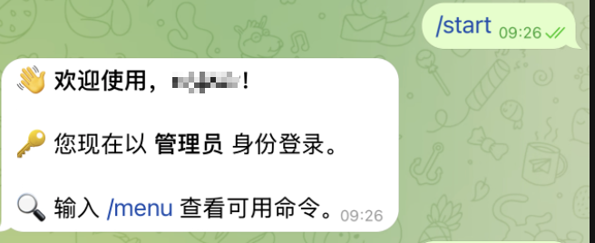
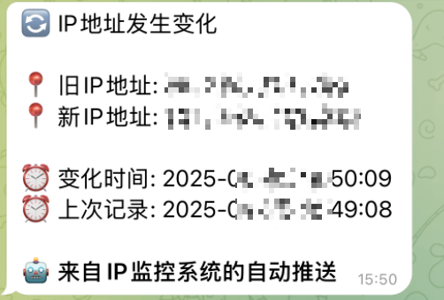

# Telegram Bot Template
一个功能完善的Telegram机器人模板。集成GitHub Actions自动构建、一键安装脚本、插件式命令系统、用户权限管理、主动推送系统等功能。

[🇺🇸 English](README.md) | 🇨🇳 中文

[](https://opensource.org/licenses/MIT)
[](https://www.python.org/downloads/)
[](https://python-telegram-bot.org/)

## ✨ 功能特点

- 📦 **插件式命令系统** - 轻松添加新命令，无需修改核心代码
- 👤 **用户权限管理** - 管理员和普通用户权限分离，支持灵活的用户管理
- 🔄 **自动注册命令** - 符合命名规范的命令自动被发现和注册
- 📋 **命令菜单管理** - 可查看所有可用命令及其权限，支持分类显示
- 👑 **用户管理功能** - 管理员可添加/删除普通用户和其他管理员
- 🔌 **动态插件加载** - 支持从内部和外部目录加载插件，热插拔式管理
- ⚙️ **配置文件支持** - 通过YAML配置文件控制插件的启用与禁用
- 🖥️ **系统状态监控** - 查看机器人运行状态、系统资源使用情况
- 📡 **主动推送系统** - 插件式推送框架，支持IP监控等自动通知功能
- 📊 **统计分析系统** - 完整的命令使用统计，支持按时间、用户分析
- 🌐 **IP管理工具** - 内置IP查看和管理功能
- 🔧 **简单易用的API** - 清晰的接口设计，便于扩展开发
- 🚀 **一键部署** - 支持自动化部署和服务管理
- 📋 **完善的日志系统** - 使用loguru实现结构化日志记录
- 🏗️ **GitHub Actions集成** - 自动构建和发布

## 🚀 快速开始

### 方式一：使用一键安装脚本（推荐）

```bash
# 安装
bash <(curl -L -s https://raw.githubusercontent.com/vvnocode/telegram-bot-template/main/install.sh)

# 卸载
bash <(curl -L -s https://raw.githubusercontent.com/vvnocode/telegram-bot-template/main/install.sh) uninstall
```

安装脚本会自动：
- 下载最新的预编译程序
- 创建系统服务
- 设置目录结构
- 配置基本参数

### 方式二：手动安装

1. **克隆项目**
```bash
git clone https://github.com/vvnocode/telegram-bot-template.git
cd telegram-bot-template
```

2. **创建虚拟环境**
```bash
python3 -m venv venv
source venv/bin/activate  # Linux/Mac
# 或
.\venv\Scripts\activate  # Windows
```

3. **安装依赖**
```bash
pip install -r requirements.txt
```

4. **配置机器人**
```bash
cp config/config.yaml.example config.yaml
# 编辑 config.yaml 填入你的 Bot Token 和用户ID
```

5. **运行机器人**
```bash
python src/main.py
```

## ⚙️ 配置说明

### 主配置文件 (config.yaml)

```yaml
# Telegram配置
telegram_bot_token: "YOUR_BOT_TOKEN"     # 机器人Token
telegram_admin_id: "ADMIN_ID1,ADMIN_ID2" # 管理员ID列表
telegram_user_id: "USER_ID1,USER_ID2"    # 普通用户ID列表

# 插件配置
plugins:
  enabled: []     # 启用的插件列表（空则加载所有）
  disabled: []    # 禁用的插件列表

# IP工具配置
get_ip_urls:
  - https://api.ipify.org
  - https://ipinfo.io/ip

# IP更换配置
change_ip:
  url: "https://api.example.com/change-ip"
  method: "GET"
  headers: {}
  data: {}
  timeout: 30
  notify_user: false
  user_daily_limit: 2
  total_daily_limit: 5

# 推送系统配置
push:
  enabled: []
  disabled: []
  plugins:
    ip_monitor:
      frequency: interval
      interval_seconds: 300
      target_admin_only: true
```

### 获取Telegram配置

1. **获取Bot Token**
   - 在Telegram中找到 [@BotFather](https://t.me/BotFather)
   - 发送 `/newbot` 创建新机器人
   - 按提示设置机器人名称和用户名
   - 获取Token

2. **获取用户ID**
   - 方法1：使用 [@userinfobot](https://t.me/userinfobot)
   - 方法2：使用 [@getmyid_bot](https://t.me/getmyid_bot)
   - 方法3：启动机器人后发送任意消息，查看日志

## 🎮 使用指南

### 基础命令
- `/start` - 机器人使用入口，显示欢迎信息
- `/menu` - 查看所有可用命令及权限要求

### 用户管理命令（管理员权限）
- `/users` - 查看所有用户和管理员列表
- `/adduser <用户ID>` - 添加普通用户（支持转发消息后回复）
- `/deluser <用户ID>` - 删除普通用户

### 实用工具
- `/status` - 查看系统状态和资源使用情况（管理员权限）
- `/get_ip` - 查看当前服务器IP地址
- `/change_ip` - 更换IP地址（如果配置了相关接口）

### 统计分析命令（管理员权限）
- `/stats_total` - 显示所有命令的总体使用统计
- `/stats_today` - 显示所有命令的今日使用统计
- `/stats_users_total` - 显示所有用户的详细使用统计
- `/stats_users_today` - 显示所有用户的今日使用统计
- `/stats_user <用户ID>` - 显示指定用户的统计信息

### 推送系统命令（管理员权限）
- `/push_status` - 查看推送系统运行状态
- `/push_list` - 列出所有推送插件及其状态
- `/push_trigger <插件名>` - 手动触发指定推送插件
- `/push_trigger_all` - 手动触发所有推送插件

## 🔧 服务管理

### Systemd服务命令
```bash
# 启动服务
sudo systemctl start telegram-bot-template

# 停止服务
sudo systemctl stop telegram-bot-template

# 重启服务
sudo systemctl restart telegram-bot-template

# 查看服务状态
sudo systemctl status telegram-bot-template

# 开机自启
sudo systemctl enable telegram-bot-template

# 查看服务日志
sudo journalctl -u telegram-bot-template -f
```

### 文件位置
- **程序文件**: `/opt/telegram-bot-template/telegram-bot-template`
- **配置文件**: `/opt/telegram-bot-template/config.yaml`
- **日志文件**: `/opt/telegram-bot-template/logs/bot.log`
- **数据目录**: `/opt/telegram-bot-template/data/`
- **外部插件**: `/opt/telegram-bot-template/plugins/`

## 🧩 插件系统

本机器人采用先进的插件系统架构，支持动态加载和管理：

### 插件加载机制

**支持的插件位置**：
1. **内置插件**: `src/bot/plugins/` - 与代码一起打包的核心插件
2. **外部插件**: 以下目录中的 `plugins/` 文件夹
   - 项目根目录: `./plugins/`
   - 可执行文件目录: `/opt/telegram-bot-template/plugins/`
   - 当前工作目录: `$(pwd)/plugins/`

**加载优先级**：
1. 禁用列表 (`disabled`) 优先级最高
2. 启用列表 (`enabled`) 次之，仅加载指定插件
3. 若无配置，则加载所有可用插件
4. 同名插件优先使用内置版本

### 插件配置管理

```yaml
plugins:
  # 仅启用指定插件
  enabled: ["menu", "start", "user"]
  
  # 禁用特定插件
  disabled: ["ip", "stats"]
```

### 开发自定义插件

#### 1. 创建插件文件

在 `/opt/telegram-bot-template/plugins/` 创建 `my_plugin.py`：

```python
from telegram import Update
from telegram.ext import ContextTypes

from src.auth import UserManager, UserRole
from src.bot.plugins.interface import PluginInterface, CommandInfo, CommandCategory
from src.logger import logger

class MyPlugin(PluginInterface):
    """自定义插件示例"""
    name = "my_plugin"
    description = "我的自定义插件"
    version = "1.0.0"
    
    def register_commands(self) -> None:
        """注册命令"""
        self.register_command(
            CommandInfo(
                command="hello",
                description="问候命令",
                handler=self.hello_command,
                category=CommandCategory.TOOLS,
                required_role=UserRole.USER
            )
        )
    
    async def hello_command(self, update: Update, context: ContextTypes.DEFAULT_TYPE, user_manager: UserManager):
        """问候命令处理"""
        user_id = update.effective_user.id
        user_info = user_manager.get_user_info(user_id)
        await update.message.reply_text(f"你好，{user_info.get('name', '用户')}！")
```

#### 2. 命令分类

插件支持以下命令分类：

| 分类 | 说明 | 示例命令 |
|------|------|----------|
| `MAIN` | 主要功能 | `/start`, `/help` |
| `MENU` | 菜单管理 | `/menu` |
| `USER` | 用户管理 | `/users`, `/adduser` |
| `SYSTEM` | 系统管理 | `/status` |
| `TOOLS` | 实用工具 | `/get_ip` |
| `STATS` | 统计分析 | `/stats_total` |

#### 3. 权限级别

- `UserRole.USER` - 普通用户权限
- `UserRole.ADMIN` - 管理员权限

### 内置插件介绍

| 插件名 | 功能 | 命令 |
|--------|------|------|
| `start` | 启动和帮助 | `/start`, `/help` |
| `menu` | 命令菜单 | `/menu` |
| `user` | 用户管理 | `/users`, `/adduser`, `/deluser` |
| `stats` | 统计分析 | `/stats_*` 系列命令 |
| `ip` | IP管理 | `/get_ip`, `/change_ip` |
| `push_control` | 推送控制 | `/push_*` 系列命令 |

## 📡 推送系统

强大的主动推送系统，支持多种推送策略和自定义插件：

### 推送频率类型

| 类型 | 说明 | 使用场景 |
|------|------|----------|
| `EVENT` | 事件驱动 | 外部触发检查 |
| `INTERVAL` | 定时间隔 | 周期性监控 |
| `ONCE` | 一次性执行 | 启动时通知 |
| `CRON` | 定时任务 | 特定时间执行（待实现） |

### 推送目标配置

```yaml
push:
  plugins:
    my_push:
      target_admin_only: true    # 仅推送给管理员
      custom_targets: []         # 自定义目标用户列表
```

### 内置推送插件

#### IP监控插件 (ip_monitor)

监控服务器IP地址变化：

```yaml
push:
  plugins:
    ip_monitor:
      enabled: true
      frequency: interval
      interval_seconds: 300      # 5分钟检查一次
      target_admin_only: true
```

**功能特性**：
- 📍 实时检测IP地址变化
- 💾 持久化状态到文件系统
- 🚀 首次启动时推送当前IP
- ✅ IP地址格式验证

### 开发推送插件

```python
from src.push.interface import PushPluginInterface, PushConfig
from src.auth import UserManager
from typing import Optional, Any

class CustomPushPlugin(PushPluginInterface):
    name = "custom_push"
    description = "自定义推送插件"
    version = "1.0.0"
    
    def __init__(self, user_manager: UserManager, config: PushConfig = None):
        super().__init__(user_manager, config)
        # 初始化插件特定配置
    
    async def check_condition(self) -> tuple[bool, Optional[str]]:
        """检查推送条件"""
        # 实现检查逻辑
        should_push = self._should_send_notification()
        message = self.get_message() if should_push else None
        return should_push, message
    
    def get_message(self, data: Any = None) -> str:
        """生成推送消息"""
        return "自定义推送消息内容"
```

## 📊 项目结构

```
telegram-bot-template/
├── .github/                  # GitHub Actions配置
│   └── workflows/
│       └── build.yml        # 自动构建工作流
├── config/                  # 配置文件模板
│   ├── config.yaml.example  # 主配置模板
│   └── commands.yaml.example # 命令配置模板
├── src/                     # 源代码目录
│   ├── main.py             # 程序入口
│   ├── config.py           # 配置加载模块
│   ├── logger.py           # 日志配置模块
│   ├── bot/                # 机器人核心
│   │   ├── core.py         # Bot核心类
│   │   ├── plugins/        # 插件系统
│   │   │   ├── interface.py    # 插件接口定义
│   │   │   ├── loader.py       # 插件加载器
│   │   │   ├── menu.py         # 菜单插件
│   │   │   ├── start.py        # 启动插件
│   │   │   ├── user.py         # 用户管理插件
│   │   │   ├── stats.py        # 统计插件
│   │   │   ├── ip.py           # IP工具插件
│   │   │   ├── push_control.py # 推送控制插件
│   │   │   └── README.md       # 插件开发文档
│   │   └── utils/              # 工具函数
│   │       └── message_helper.py # 消息处理助手
│   ├── push/               # 推送系统
│   │   ├── interface.py    # 推送接口定义
│   │   ├── manager.py      # 推送管理器
│   │   ├── plugins/        # 推送插件
│   │   │   └── ip_monitor.py   # IP监控插件
│   │   └── README.md       # 推送系统文档
│   ├── auth/               # 认证授权
│   │   ├── permissions.py  # 权限定义
│   │   └── user.py         # 用户管理
│   └── utils/              # 通用工具
│       └── stats.py        # 统计管理
├── data/                   # 数据目录
│   └── stats/              # 统计数据
│       └── daily/          # 日常统计
├── logs/                   # 日志目录
├── dist/                   # 构建输出
├── build/                  # 构建临时文件
├── img/                    # 项目截图
├── requirements.txt        # Python依赖
├── build.sh               # 构建脚本
├── install.sh             # 安装脚本
├── telegram-bot-template.spec # PyInstaller配置
├── config.yaml            # 运行时配置
├── .gitignore            # Git忽略规则
├── LICENSE               # MIT许可证
└── README.md             # 项目文档
```

## 👥 用户权限管理

### 权限角色

1. **普通用户 (USER)**
   - 访问基本命令：`/start`, `/help`, `/menu`
   - 使用工具命令：`/get_ip`

2. **管理员 (ADMIN)**
   - 拥有所有普通用户权限
   - 用户管理：添加/删除用户和管理员
   - 系统管理：查看状态、统计信息
   - 推送控制：管理推送系统

### 用户管理操作

```bash
# 查看用户列表
/users

# 添加普通用户
/adduser 123456789
# 或转发用户消息后回复
/adduser

# 删除普通用户
/deluser 123456789

# 添加管理员
/addadmin 123456789

# 删除管理员
/deladmin 123456789
```

### 权限配置

在 `config.yaml` 中配置：

```yaml
# 普通用户列表
telegram_user_id: "123456789,987654321"

# 管理员列表
telegram_admin_id: "111111111,222222222"
```

## 📈 统计系统

完善的使用统计和分析功能：

### 统计功能

- **命令统计**: 记录每个命令的使用次数和时间
- **用户统计**: 分析用户活跃度和使用习惯
- **时间统计**: 支持日统计和总体统计
- **数据持久化**: 统计数据保存到文件系统

### 统计命令

| 命令 | 功能 | 权限 |
|------|------|------|
| `/stats_total` | 总体命令统计 | 管理员 |
| `/stats_today` | 今日命令统计 | 管理员 |
| `/stats_users_total` | 用户使用统计 | 管理员 |
| `/stats_users_today` | 今日用户统计 | 管理员 |
| `/stats_user <ID>` | 指定用户统计 | 管理员 |

### 数据存储

```
data/
└── stats/
    ├── total.json           # 总体统计
    ├── users.json          # 用户统计
    └── daily/
        └── YYYY-MM-DD.json # 日统计
```

## 🏗️ 开发与构建

### 开发环境搭建

1. **克隆仓库**
```bash
git clone https://github.com/vvnocode/telegram-bot-template.git
cd telegram-bot-template
```

2. **设置虚拟环境**
```bash
python3 -m venv venv
source venv/bin/activate
pip install -r requirements.txt
```

3. **配置开发环境**
```bash
cp config/config.yaml.example config.yaml
# 编辑 config.yaml 配置开发参数
```

4. **运行开发服务器**
```bash
python src/main.py
```

### 依赖说明

| 依赖包 | 版本 | 用途 |
|--------|------|------|
| `python-telegram-bot` | 20.7 | Telegram Bot API |
| `PyYAML` | ≥6.0 | YAML配置文件解析 |
| `loguru` | ~0.7.2 | 结构化日志记录 |
| `psutil` | ≥5.9.0 | 系统信息获取 |
| `requests` | ≥2.31.0 | HTTP请求处理 |

### 构建和打包

```bash
# 本地构建
bash build.sh

# 构建产物位置
ls dist/telegram-bot-template
```

### GitHub Actions自动构建

项目集成了GitHub Actions，支持：

- **自动构建**: 推送标签时自动构建
- **多平台支持**: Linux x64构建
- **自动发布**: 构建完成后自动创建Release

**配置步骤**：
1. 创建 [Personal Access Token](https://github.com/settings/tokens)
2. 在仓库设置中添加 `MY_GITHUB_TOKEN` 密钥
3. 推送标签触发构建：`git tag v1.0.0 && git push origin v1.0.0`

## 🔧 常见问题

### 安装和配置问题

**Q: 如何获取Telegram Bot Token？**
A: 
1. 在Telegram中找到 [@BotFather](https://t.me/BotFather)
2. 发送 `/newbot` 创建机器人
3. 按提示设置名称和用户名
4. 复制返回的Token

**Q: 如何获取用户ID？**
A:
- 使用 [@userinfobot](https://t.me/userinfobot)
- 使用 [@getmyid_bot](https://t.me/getmyid_bot)  
- 启动机器人后发送消息，查看日志输出

**Q: 服务无法启动怎么办？**
A:
```bash
# 检查服务状态
sudo systemctl status telegram-bot-template

# 查看详细日志
sudo journalctl -u telegram-bot-template -f

# 检查配置文件
cat /opt/telegram-bot-template/config.yaml
```

### 权限和用户管理

**Q: 如何重置管理员权限？**
A: 直接编辑配置文件：
```bash
sudo nano /opt/telegram-bot-template/config.yaml
# 修改 telegram_admin_id 字段
sudo systemctl restart telegram-bot-template
```

**Q: 用户添加失败怎么办？**
A: 确保：
- 用户ID格式正确（纯数字）
- 机器人有权限给该用户发消息
- 用户已与机器人进行过对话

### 插件开发问题

**Q: 自定义插件不生效？**
A: 检查：
- 插件文件是否在正确位置
- 类名和文件名是否匹配
- 是否继承了 `PluginInterface`
- 是否实现了 `register_commands` 方法
- 配置文件中是否被禁用

**Q: 如何调试插件？**
A: 
```bash
# 查看插件加载日志
sudo journalctl -u telegram-bot-template | grep -i plugin

# 启用调试模式（在config.yaml中）
log_level: DEBUG
```

### 性能和稳定性

**Q: 机器人响应慢怎么办？**
A:
- 检查系统资源使用情况
- 优化插件代码中的耗时操作
- 考虑增加异步处理
- 检查网络连接质量

**Q: 如何备份数据？**
A:
```bash
# 备份整个应用目录
sudo tar -czf telegram-bot-backup.tar.gz /opt/telegram-bot-template

# 仅备份配置和数据
sudo tar -czf config-data-backup.tar.gz \
  /opt/telegram-bot-template/config.yaml \
  /opt/telegram-bot-template/data/
```

## 📸 效果展示

### 普通用户界面


*普通用户可以访问基础命令，查看菜单和使用工具功能*

### 管理员界面  


*管理员拥有完整权限，可以管理用户、查看统计和控制系统*

### 命令菜单


*清晰的命令分类和权限显示，便于用户了解可用功能*

### IP变更推送


*检测到IP变更后，自动推送*

## 🤝 贡献指南

我们欢迎所有形式的贡献！

### 如何参与

1. **Fork 项目**到你的GitHub账户
2. **创建特性分支**: `git checkout -b feature/amazing-feature`
3. **提交更改**: `git commit -m 'Add amazing feature'`
4. **推送分支**: `git push origin feature/amazing-feature`
5. **创建 Pull Request**

### 贡献类型

- 🐛 **Bug修复**: 报告或修复发现的问题
- ✨ **新功能**: 添加有用的新特性
- 📝 **文档改进**: 完善文档和示例
- 🔧 **代码优化**: 提升代码质量和性能
- 🧪 **测试添加**: 增加测试覆盖率
- 🌐 **国际化**: 添加多语言支持

### 开发规范

- 遵循现有代码风格
- 添加适当的注释和文档
- 确保向后兼容性
- 提供测试用例
- 更新相关文档

## 📄 许可证

本项目基于 [MIT License](LICENSE) 开源。

## 🔗 相关链接

- **项目主页**: https://github.com/vvnocode/telegram-bot-template
- **问题反馈**: https://github.com/vvnocode/telegram-bot-template/issues
- **发布页面**: https://github.com/vvnocode/telegram-bot-template/releases
- **Telegram Bot API**: https://core.telegram.org/bots/api
- **Python Telegram Bot**: https://python-telegram-bot.org/

---

如果这个项目对你有帮助，请给个 ⭐ Star 支持一下！